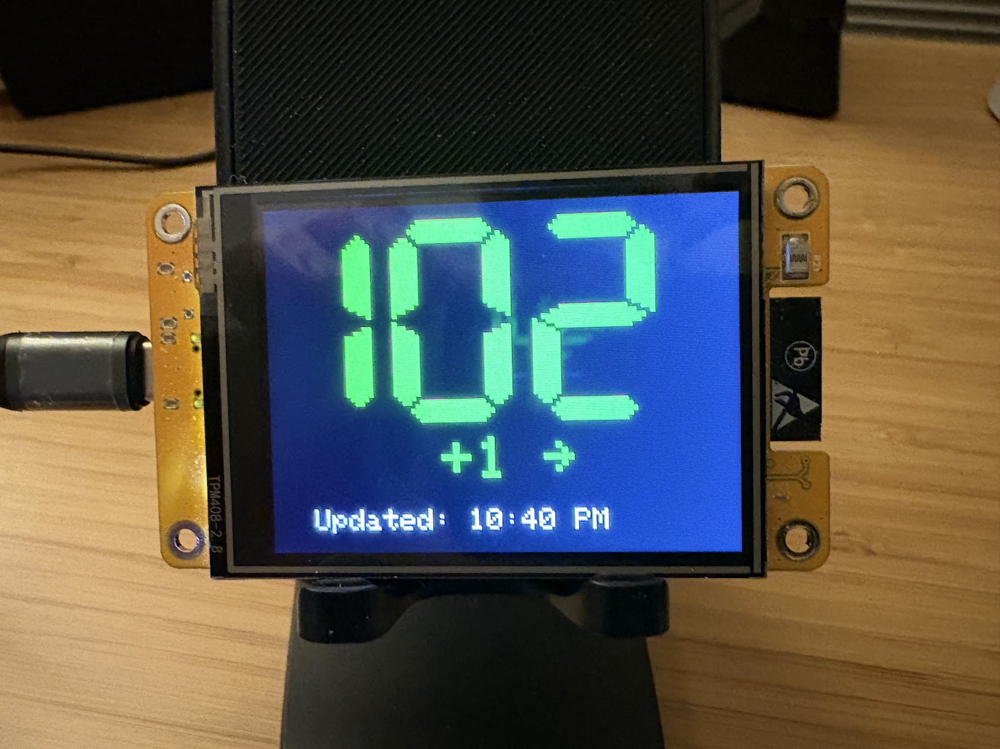
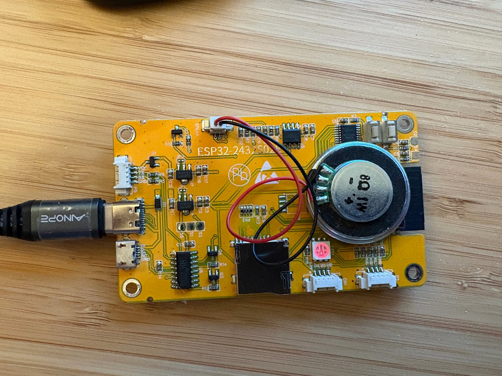

# Sugar Surfboard

This is a simple monitor to display the current glucose level and trend through an ESP32 and a 2.8" TFT LCD display.

Initially forked from project done by Pablo Medina: https://github.com/jmedina21/dexcom-esp32-monitor

### Front


### Back (speaker)


## Features

-   Display current glucose with **BIG** numbers
-   Display the change from the previous reading, trend, and last update time
-   Sugar surfing notification beeps for incoming high or low glucose (catch highs and lows before they happen)
-   Low glucose alarm beeps

## Requirements

-   ESP32 board with 2.8" TFT LCD display
-   Small speaker with PH2.0/1.25mm-2P connector for beep sounds 
-   Have a Dexcom account that can share BG numbers

## Recommended Hardware / Software
- [AITRIP 2 Pack ESP32 Development Board](https://www.amazon.com/dp/B0CLR7MQ91?th=1)
- [uxcell 1W 8 Ohm DIY Magnetic Speaker 28mm 2 Pack](https://www.amazon.com/dp/B0826551ZZ)
- Arduino IDE to build and load onto device
- As of March 2026, can build 2 with this hardware for less than $40

## Quick Setup Using this Hardware
- Install Arduino IDE
- Download / clone this repository
- Create a "mycreds.h" file in the Dexcom-Monitor folder with the following contents (replace with your wifi and dexcom info):
```
const char *ssid = "MY WIFI SSID";     // Replace with your Wi-Fi SSID
const char *password = "MY WIFI PASSWORD"; // Replace with your Wi-Fi password
const char *dexcomUsername = "my_dexcom_username";	// Replace with dexcom account username
const char *dexcomPassword = "MY DEXCOM PASSWORD"; // Replace with dexcom account password
```
- Load Dexcom-Monitor.ino in the Arduino IDE
- Connect your board to your computer, and upload the program with Arduino IDE
- Open the Serial Monitor at 115200 baud to see log output

## Notes

- This code should work on other ESP32 microcontrollers and with other 2.8" TFT LCD displays but I have no tested them
- Big thank you to Pablo Medina. This project is a fork of his [Dexcom Monitor](https://github.com/jmedina21/dexcom-esp32-monitor) project
- Big thank you to Stephen W. Ponder and Kevin L. McMahon whose excellent book [Sugar Surfing](https://www.amazon.com/Sugar-Surfing-Manage-Diabetes-Modern/dp/0996253904) was the inspiration for this project 

